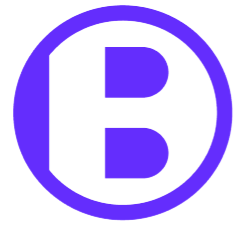

  

# **BoldMint**

### A Platform for Creators and Web3 Enthusiasts

---

### **Idea and Motivation**

For the reader, it’s a familiar scene: the smell of fresh coffee brewing, a comfy chair, and the anticipation of reading a new post from your favorite creator. Whether it’s an insightful blog, a witty Twitter thread, or a thought-provoking LinkedIn post, we all have that person we follow whose content we just can’t wait to dive into. Their words inspire us, entertain us, or simply make our day better. It's not just about the content—it’s about the connection we feel with the person behind the words. Yet, how often do we stop and think about the effort that goes into producing that content?

For the creator, things look a bit different. Behind each well-crafted post is a deep well of creativity, research, and dedication. Every word and every post comes from a place of passion, but it also requires time and effort to maintain consistency, relevance, and engagement. The most talented content creators can spend hours or even days perfecting a single piece. And while the love for creating content is often the primary motivator, the question eventually arises: How can I turn this passion into a sustainable income? For many, this is where they hit a wall.

Traditional platforms offer few ways to monetize the kind of short-form, insightful content that keeps readers coming back for more. Also, creators often rely on platforms like Patreon or accept PayPal donations to monetize their work. While these platforms provide a way for creators to earn an income, they also come with high fees, slow payment processing, and limited ownership over the content. In fact, only [3%](https://www.uscreen.tv/blog/is-patreon-worth-it/) of creators on traditional platforms like Patreon earn a sustainable income from their content, while many rely on multiple platforms to piece together an income stream.

That’s where BoldMint steps in.

### Introducing BoldMint

BoldMint is a cutting-edge platform that allows creators to mint their content as NFTs, enabling them to monetize their work in a way that’s fast, transparent, and secure. Built on the Solana blockchain, BoldMint empowers creators to maintain ownership of their digital assets while allowing fans to support them financially by purchasing NFTs using SOL, Solana’s native cryptocurrency.

With Solana, BoldMint ensures fast, low-cost transactions that make content monetization accessible to everyone, whether you’re a seasoned creator or just starting out. Solana’s blockchain is optimized for speed and scalability, which means creators don’t have to worry about high transaction fees or long delays. As a result, creators can focus on what they do best—producing great content—while knowing that BoldMint offers a reliable way to earn income from their efforts.

### Disclaimer: BoldMint isn't here to replace Patreon

While BoldMint offers creators an innovative way to monetize their content, we aren't looking to replace existing platforms like Patreon or PayPal. Instead, BoldMint complements these platforms by introducing blockchain technology(specifically Solana) into the equation with aims to provide an additional way for content creators to monetize their work. Many creators on platforms like Patreon still struggle with monetization, and offering a new revenue stream through crypto—without PayPal’s high transaction fees or platform cuts—addresses that gap.

This way, BoldMint expands creators' opportunities rather than forcing them to choose between existing methods and new options.

## **App Logic**

Upon becoming a creator, each user is assigned a unique NFT collection which is minted by BoldMint.

In order to access creator's content, user has to have NFT from his collection. He has 2 options:

1. User mints NFT via BoldMint app for a price which is set inside an app and is calculated by app's algorithm which takes factors such as follower count, engagement metrics, and demand. As creators grow more popular, the value of their NFTs increases, reflecting their standing in the community.

2. User can buy NFT from other users who have already purchased it

## **Business part**

BoldMint operates on a revenue-sharing model that includes fees for both NFT minting and secondary sales. This structure ensures sustainability and provides ongoing support for the platform while rewarding creators.

1. **Minting Fees**:  
   When users mint an NFT through the BoldMint app, a **small fee** is applied. This fee helps maintain the platform and supports ongoing development and improvements. This is enabled by Solana's technology, which allows for multiple transfers to be bundled into a single transaction, reducing costs for users.

2. **Secondary Sales**:  
   When NFTs are resold in the secondary market, BoldMint receives a portion of the sale through a mechanism defined in the NFT’s metadata via **`seller_fee_basis_points`** and **`creators`** fields which specifies the percentage fees that BoldMint and creator collect from each transaction. This ensures that both BoldMint and creator benefit from the ongoing popularity of the creator's content and provides a continuous revenue stream.

To promote inclusivity, the price of creating an NFT collection is covered by BoldMint, ensuring that everyone has an equal opportunity to become a creator without any upfront costs. This way, creators have nothing to lose, fostering a healthy and strong community where talent can thrive.

## **Tech Specifications**

- **Frontend**:

  - **Tailwind CSS** for responsive and modern design.
  - **React** integrated within the Next.js framework, leveraging its dynamic routes and user authentication.

- **Backend**:

  - The backend functionality is integrated within the Next.js framework, leveraging its API routes for managing data fetching.

- **Database**:

  - Temporarary using **Contentful** headless CMS to avoid nuances involved with deploying a database to production environment.

### **Blockchain**:

1. **Solana**: Fast, low-cost transactions and NFT minting. Interaction with blockchain is enabled via **@solana/web3.js** SDK while **@solana/wallet-adapter-base**, **@solana/wallet-adapter-base-ui**, **@solana/wallet-adapter-react**, **@solana/wallet-adapter-react-ui** and **@solana/wallet-adapter-wallets** enable seamless wallet integration inside an app.

2. **Metaplex**: Since the model and logic of BoldMint are centered around NFTs, leveraging Metaplex on the Solana blockchain is an ideal choice. Metaplex offers powerful tools for the creation of NFT collections and the ability to group NFTs, fitting perfectly into our platform's vision of monetizing creator content through unique digital assets. Furthermore, all NFTs minted by supporters are verified, ensuring authenticity and building trust within the community. This verification process is crucial for maintaining the integrity of the NFTs and enhancing the overall user experience. More details can be found in the [Metaplex documentation](https://developers.metaplex.com/token-metadata/collections). Currently, the NFT minting is done via **@metaplex-foundation/js** package and its **nfts()** module, rather than the newest [**Candy Machine Core**](https://developers.metaplex.com/core-candy-machine/overview).

3) **NFT Metadata Storage**: NFT metadata is uploaded to **IPFS** using **Pinata**, a popular service that simplifies the process of storing and managing files on the InterPlanetary File System (IPFS). This approach ensures that NFT metadata remains decentralized and accessible, aligning with the principles of blockchain technology.
4) **Connection**: In order to increase performance while minting NFTs, we utilize **Helius RPC** to interact with the Solana blockchain and **confirmed** confirmation level.

### **Deployment**:

- Deployed via **Vercel** on LINK

### **Security**:

- All application pages and API calls are secured from unauthorized access thank to **next-auth** package. Also, it enables integration with wide range of authentication providers for user login including **Google** and **Github** which were used for this app.

## **Future Plans and Improvements**

As BoldMint continues to evolve, we have several key areas of focus for future enhancements:

#### **Platform Enhancements**

- **Migrating to Metaplex Candy Machine Core**: Transitioning to the Candy Machine Core will allow for more robust minting features.
- **Improvement in Price Calculation Algorithm**: Currently, for simplicity, a basic quadratic function is used to calculate the prices of NFTs based on their popularity and demand. While this approach provides a straightforward method for pricing, it requires enhancement to better reflect market dynamics and user engagement. Upgrading the price calculation algorithm is crucial to the app's success, as it will ensure that creators receive fair compensation and that pricing is competitive and aligned with user expectations.

#### **Content Expansion**

- **Expansion to Support Wider Types of Content**: We aim to diversify the types of content creators can tokenize.
- **Enable Multiple Layers/Levels of Content Types and Supporters**: Introducing a multi-tier system will allow creators to offer various access levels and rewards to their supporters.

#### **Analytics and Insights**

- **Enhance Creator Analytics About Their Supporters and Content**: Providing in-depth analytics will empower creators to understand their audience better and optimize their content strategies.

#### **NFT Functionality**

- **NFT on the Content Level**: We plan to enable creators to mint NFTs for individual pieces of content, allowing supporters to purchase access to specific articles or posts.
- **Enable a Place for Users to List and Trade NFTs**: Introducing a marketplace feature will allow users to list and trade NFTs from specific collections or creators, fostering a vibrant secondary market.

These enhancements will not only improve the user experience but also empower creators to maximize their potential on the BoldMint platform.
